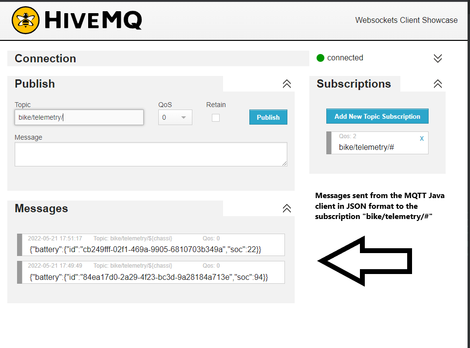

<h2>MQTT Client</h2>

O objetivo do projeto é a construção de um servidor utilizando o protocolo MQTT para simular a comunicação entre sensores (publishers) e clientes (subscribers).
Neste projeto usei o nível de Quality of Service (QoS) 0 para efetuar os publishes.

Durante o projeto, são utilizadas as seguintes ferramentas e tecnologias:

* Java 11 
* Biblioteca HiveMQ Client para Java
* Princípios de POO
* Protocolo MQTT
* IntelliJ IDEA

<h2>HiveMQ Websocket</h2>

* Exemplo de comunicação utilizando a interface WEB do HiveMQ como client (Subscriber) e este projeto como Publisher:

<p align="center">
  
</p>

<h2>Modelo OPP</h2>

* Moto
* Bateria
* Fábrica
* Fornecedor

Considerando as seguintes características:

- Moto é fabricada na Fábrica
    - Moto é identificada por um chassi (uma string random de 17 chars)
    - Moto pode ser perguntada por um pacote de dados (telemetria). Se ela tiver
    uma bateria, o pacote de dados inclui o identificador e soc da Bateria
    - O pacote de dados possui formato JSON.
    - Moto se comunica através de MQTT pelo tópico 'bike/telemetry/${chassi}',
    faça uma ação 'publish' que manda o pacote de dados no canal.
- Bateria é solicitada ao Fornecedor
    - Bateria tem um Identificador (um inteiro random)
    - Bateria pode ser inserida e removida da Moto - Bateria informa 'soc'(State of
    Charge)

Para executar o projeto:

* Clone o repositório na sua máquina com o seguinte comando:
```shell script
git clone https://github.com/gabrielcastroo/mqtt-client.git 
```
* Ou caso use SSH:
```shell script
git clone git@github.com:gabrielcastroo/mqtt-client.git 
```
* Abra a pasta projeto no IntelliJ IDEA Community, para que ele possa baixar todas as dependências especificadas no arquivo 'pom.xml' automaticamente.
* Aperte 'SHIFT + F10' ou a opção 'Run' no IntelliJ para rodar o projeto.
